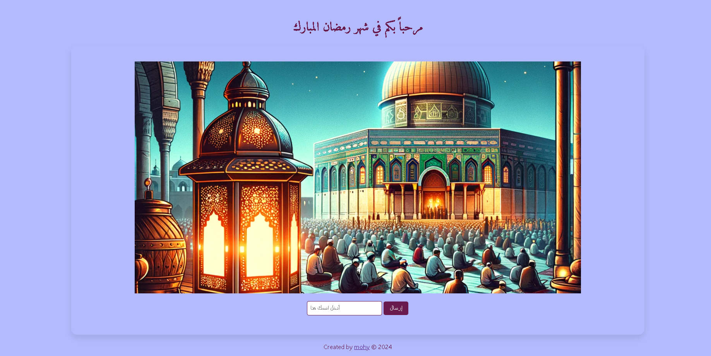

# مشروع شهر رمضان المبارك

## نبذة عن المشروع
هذا المشروع عبارة عن صفحة ويب تحتفل بشهر رمضان المبارك، تسمح للمستخدمين بإدخال أسمائهم وتلقي تحيات بمناسبة الشهر الفضيل.

## ميزات المشروع
- استقبال اسم المستخدم عبر نموذج.
- عرض تحية مخصصة باستخدام اسم المستخدم.
- التحقق من الإدخال للتأكد من استخدام الحروف العربية فقط.

## التقنيات المستخدمة
- HTML
- CSS
- JavaScript
- خط Amiri للعناوين والنصوص العربية.

## كيفية استخدام المشروع
1. افتح المشروع في متصفحك.
2. ادخل اسمك باللغة العربية في الحقل المخصص.
3. اضغط على زر "إرسال" لتلقي التحية.

## معاينة المشروع

## المساهمة في المشروع
نرحب بمساهماتكم في تحسين المشروع. يمكنكم المساهمة عن طريق:
- التبليغ عن الأخطاء
- طلب ميزات جديدة
- إرسال Pull Requests بتحسينات أو إضافات

## الرخصة
[MIT](رابط-لملف-الرخصة-إذا-توفر)

## صاحب المشروع
- [mohy](https://github.com/mohy)

شكرًا لزيارتكم لمشروعي وأتمنى أن ينال إعجابكم!
